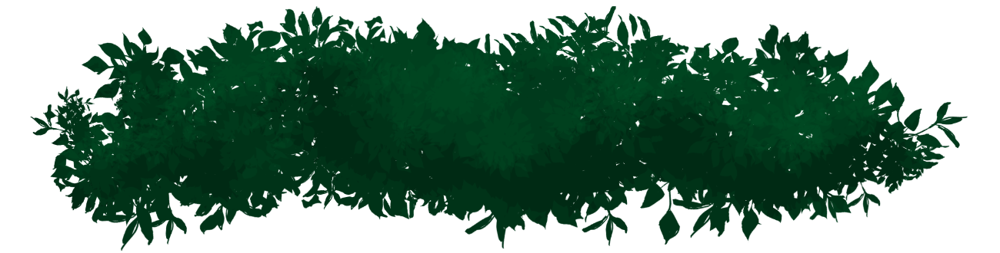
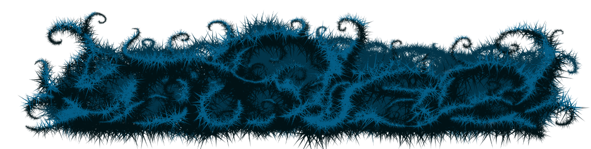
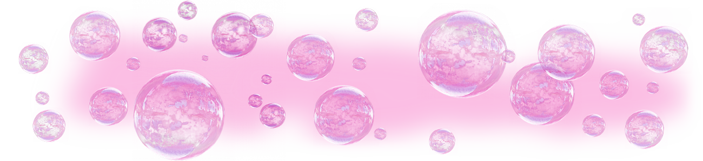

# WuhdAppusDat

"WuhdAppusDat" answers the question "What app is that" by all your little pog champ viewers.

Free, open source, desktop app for streamers that lets their audience know what program is currently in focus.

> ***"Great for art, game dev, and coding streams!"***

* * *

## LIVE DEMO

* [Twitch Clip](https://www.youtube.com/watch?v=z6R2sItBGS8) - Look at the bottom to see WuhdAppusDat reveal the currently focused application. (**Note:** the styling is completely customizable)

> "Fantastic, this is exactly what I needed" - Adam Phillips (chluaid), animator of "Bitey of Brackenwood", Twitch Streamer

* * *

<h1 align="center">==== DOWNLOADS AVAILABLE ====</h1>

Downloads are available under the [GitHub Releases](https://github.com/TheJaredWilcurt/WuhdAppusDat/releases) tab.

**Supported Systems:** Windows 7, 8, 10 (64-Bit only). Ubuntu 17+ (64-Bit). OSX 10.11+ (64-Bit)

**Note:** You can modify the `app-map.json` file to change how program names are displayed.

## Windows

NO INSTALLATION REQUIRED! This is a portable app.

1. Download zip
1. Unzip file
1. Double-click on `WuhdAppusDat.exe`

You can `right-click + drag` to create a shortcut to `WuhdAppusDat.exe`. Put the shortcut in your start menu or on the desktop.

## Linux/OSX

Builds are not available yet. However you can follow the "Running locally for development" instructions to try it out.

OSX: You may need to allow running a program from the internet.

OSX: You may need to allow WuhdAppusDat to have access to "Accessibility Features" (this is how it can see the title of the currently focused window).

* * *

## Features

* Transparent, resizable window that states the name of the currently focused executable
* Ships with the following background images, or can use your own.

* Backgrounds stretch to fit inside the transparent window without being cropped
* Background image Hue, Saturation, Brightness, and Contrast can be adujsted
* Retains your settings, window size/positioning between uses (settings are stored per-user account on the PC)
* Text size, color, formatting, and drop shadow are customizable
* Allows for any installed system font, including custom ones you've downloaded or created
* Can be pinned to "Always on Top"
* App can be targeted by OBS, StreamLabs and similar software to be added as an overlay in a scene.

* * *

## Running locally for development

### Environment setup

The `windows-active-process` and `active-win` dependencies require a native module be built.

1. Set up Node Version Manager:
   * Windows: [nvm-windows](https://github.com/coreybutler/nvm-windows/releases)
   * Linux/OSX: [nvm](https://github.com/nvm-sh/nvm)
1. Use `nvm` to install **SPECIFICALLY** Node.js [v10.11.0](https://nodejs.org/dist/v13.13.0/) (to match NW.js).
   * `nvm install 10.11.0 && nvm use 10.11.0`
1. On OSX 10.13 and below install [Swift runtime support libraries](https://support.apple.com/kb/DL1998)
1. On Windows:
   * run `npm install -g windows-build-tools`
   * You may need to run `Set-ExecutionPolicy -ExecutionPolicy Unrestricted -Scope CurrentUser` in Powershell
   * You may need to install Visual Studio Community Edition
1. `npm install -g nw-gyp`
1. Download or clone the repo
1. `npm install`

### Running loally

1. Do the environment setup once
1. `npm start`

* * *

## Technology Colophon

* Written in Vanilla JS, HTML, and CSS, and a lil Vue.js.
* Built with NW.js and Node.js.
* Windows version relies on "windows-active-process" library.
* Linux/OSX version relies on "active-win" library.
* Built on Windows 7, OSX 10.11, Ubuntu 17, with SublimeText 3 and Photoshop CS6.
